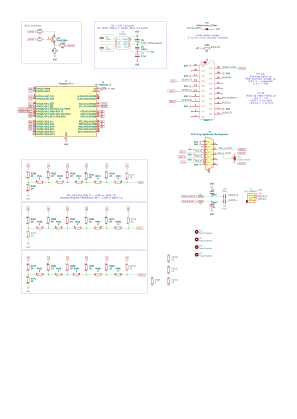
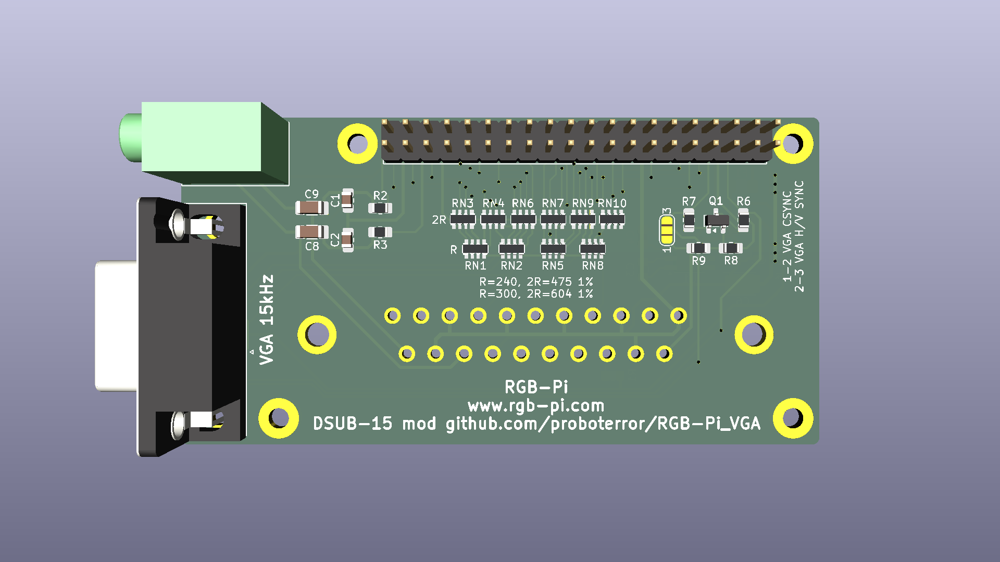
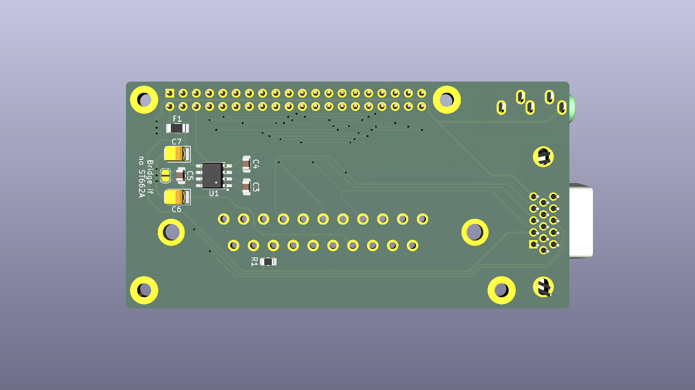
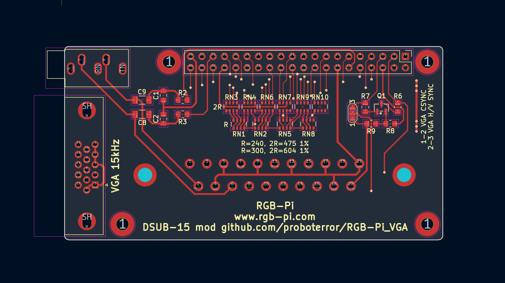
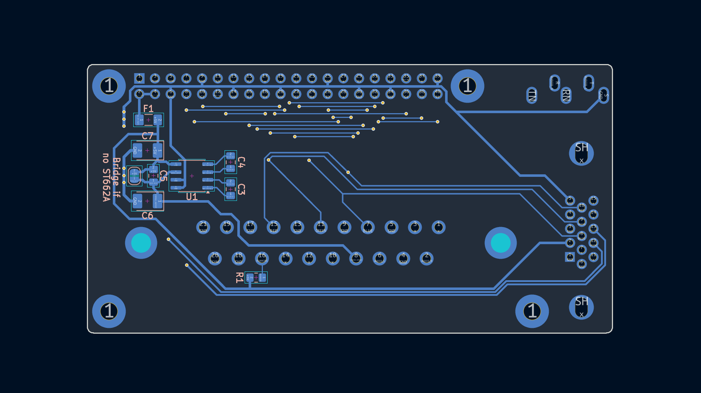

# RGB-Pi with VGA 15 kHz

Improved [RGB-Pi adapter](https://www.rgb-pi.com) for use with RGB-Pi OS.

Based on [open schematic publised by mortaca](https://github.com/mortaca/RGB-Pi).

Original RGB-Pi documentation: [www.mortaca.com/docs/wiki](https://www.mortaca.com/docs/wiki/index.php?title=RGB-Pi)

Changes:
- Added VGA (DSUB-15) 15 kHz connector (Warning: 31 kHz VGA monitors not supported). 
- Proper sync combiner, borrowed from from [BKM-129X clone board](https://github.com/skumlos/bkm-129x-scart-vga), see also [KabukiFlux's RGBpi cable sync mixer](https://github.com/KabukiFlux/pi-rgb-cable-sync-mixer).
- Improved R-2R RGB DAC.
- Added 3.5 mm audio jack connector.

## Schematics: 

## Board view: 

## Bill of Materials
|Reference|Value|Footprint|Qty|
|-----|-----|-----|-----|
|C1,C2|100nF|0805|3|
|C8,C9|10uF|1206|2|
|F1|MF-NSMF012-2| 1206 Bourns MF-NSMF012-2 0.12A 30V|1|
|J1|Raspberry_Pi_4| PinHeader_2x20_P2.54mm_Vertical |1|
|J2|SCART-F|CS-102 (SCART-21S)|1|
|J3|DE15 Socket / DSUB-15-HD / VGA| DSUB-15-HD_Socket_Horizontal P2.29x1.90mm EdgePinOffset3.03mm MountingHolesOffset4.94mm|1|
|J4|SJ1-3535NG|CUI/Same Sky Device SJ1-3535NG|1|
|Q1|MMBT3904|SOT-23|1|
|R1|120R|0805|1|
|R2,R3|220R|0805|2|
|R6|100R|0805|1|
|R7|10K|0805|1|
|R8|1K|0805|1|
|R9|470R|0805|1|
|RN1,RN2,RN5,RN8|R = 240R or 300R 1%|Resistor Array 4x0603 |4|
|RN3,RN4,RN6,RN7,RN9,RN10|2R = 475R or 604R 1%|Resistor Array 4x0603|6|

Optional (SCART 5V->12V Converter for Status & Aspect Ratio switch):

|Reference|Value|Footprint|Qty|
|-----|-----|-----|-----|
|C5|100nF|0805|3|
|C3,C4|220nF|0805|2|
|C6,C7|4.7uF|Tantalum EIA-3528-21 / Kemet-B|2|
|U1|ST662A|SO-8_3.9x4.9mm_P1.27mm|1|
